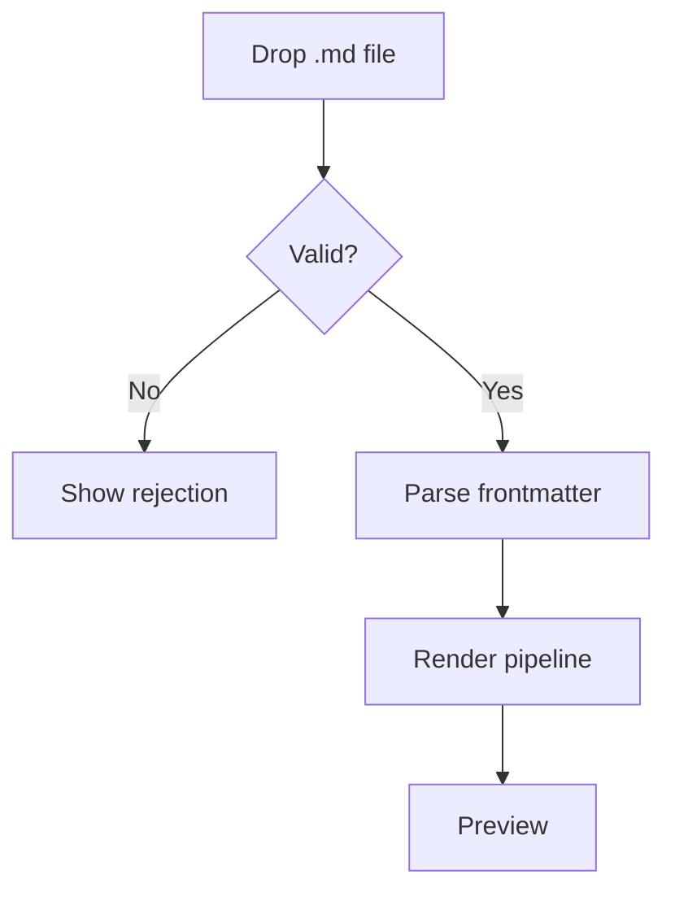
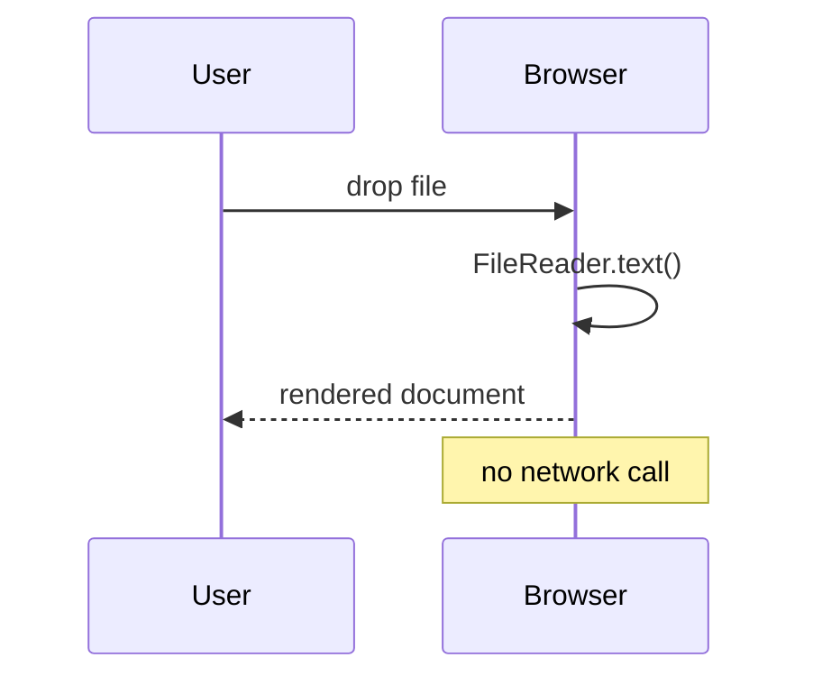

# Torture Test

Exercises every feature the viewer claims to support. Drop this file in and check each section.

## Inline basics

**Bold**, _italic_, ***both***, ~~strikethrough~~, `inline code`, <kbd>Cmd</kbd>+<kbd>K</kbd>, H<sub>2</sub>O, x<sup>2</sup>, <mark>highlighted</mark>, and an <abbr title="Abbreviation">abbr</abbr>.

A very long inline URL that must wrap rather than scroll the page sideways: `https://example.com/an/extremely/long/path/segment/that/keeps/going/and/going/and/going/forever?query=true&more=yes`

Autolink: https://example.com

## Headings after headings

### Immediately nested

#### And deeper

Text finally appears here.

## Lists

- Unordered one
- Unordered two
  - Nested
    - Deeper
- Unordered three

1. Ordered
2. Items
   1. Nested ordered
   2. Second

- [x] Completed task
- [ ] Incomplete task
- [ ] Another with `code` and **bold**

Definition list:

<dl>
  <dt>Term</dt>
  <dd>Definition of the term.</dd>
</dl>

## Blockquote

> A quote with **formatting**.
>
> > And a nested quote.
>
> — Attribution

## Tables

| Left | Center | Right | Notes |
| :--- | :----: | ----: | ----- |
| a | b | 1 | short |
| longer cell content | centered | 12345 | `code` |
| **bold** | _em_ | -42 | [link](https://example.com) |

Wide table that must scroll inside its own container:

| col1 | col2 | col3 | col4 | col5 | col6 | col7 | col8 | col9 | col10 | col11 | col12 |
| ---- | ---- | ---- | ---- | ---- | ---- | ---- | ---- | ---- | ----- | ----- | ----- |
| aaaaaaaaaa | bbbbbbbbbb | cccccccccc | dddddddddd | eeeeeeeeee | ffffffffff | gggggggggg | hhhhhhhhhh | iiiiiiiiii | jjjjjjjjjj | kkkkkkkkkk | llllllllll |

## Code — eager languages

```ts
type Result<T, E = Error> =
  | { ok: true; value: T }
  | { ok: false; error: E };

export async function attempt<T>(fn: () => Promise<T>): Promise<Result<T>> {
  try {
    return { ok: true, value: await fn() };
  } catch (error) {
    return { ok: false, error: error as Error };
  }
}
```

```python
from dataclasses import dataclass

@dataclass(frozen=True)
class Point:
    x: float
    y: float

    def scaled(self, k: float) -> "Point":
        return Point(self.x * k, self.y * k)
```

```bash
rg --files-with-matches 'connect-src' -g '!node_modules' | xargs -I{} echo "found: {}"
```

```json
{ "csp": { "connect-src": "'self'" }, "uploads": false }
```

## Code — lazy-loaded languages

```rust
fn main() {
    let names = vec!["a", "b", "c"];
    for (i, n) in names.iter().enumerate() {
        println!("{i}: {n}");
    }
}
```

```go
package main

import "fmt"

func main() {
	ch := make(chan int, 3)
	go func() { defer close(ch); ch <- 1 }()
	fmt.Println(<-ch)
}
```

```sql
SELECT host, count(*) AS hits
FROM requests
WHERE created_at > now() - interval '7 days'
GROUP BY host
ORDER BY hits DESC;
```

## Code — unknown language and no language

```notarealanguage
this should fall back to plain text, not crash
```

```
no language fence
  preserved   whitespace
```

A code block long enough to scroll horizontally: 

```js
const x = { alpha: 1, beta: 2, gamma: 3, delta: 4, epsilon: 5, zeta: 6, eta: 7, theta: 8, iota: 9, kappa: 10, lambda: 11 };
```

## Math

Inline: the mass-energy equivalence $E = mc^2$ sits in a sentence.

Display:

$$
\frac{\partial u}{\partial t} = \alpha \nabla^2 u
$$

$$
\begin{aligned}
\sum_{i=1}^{n} i &= \frac{n(n+1)}{2} \\
\int_0^1 x^2 \,dx &= \frac{1}{3}
\end{aligned}
$$

## Mermaid





Deliberately broken diagram — should degrade to source, not crash:

```mermaid
flowchart TD
    A[unclosed --> B{{{
```

## Images

Remote, should be gated until opt-in:


Relative, unresolvable from a single file:


Inline data URI, should render immediately with no gate:


## Raw HTML

<details>
<summary>Collapsed section — click to expand</summary>

Content inside `<details>` with a nested list:

- item one
- item two

</details>

<p align="center">
  <strong>Centered paragraph via raw HTML</strong>
</p>

<figure>
  <figcaption>A figure caption</figcaption>
</figure>

## Hostile HTML — every one of these must be stripped

<script>alert('xss')</script>


<a href="javascript:alert('xss')">javascript: link</a>

<iframe src="https://example.com"></iframe>

<form action="https://evil.example.com"><input type="submit" value="submit"></form>

<style>body { display: none !important; }</style>

<div onclick="alert('xss')">click handler on div</div>

<object data="evil.swf"></object>

## Footnotes

Statement needing a source[^1]. And another[^note].

[^1]: The first footnote.
[^note]: A named footnote with `code` and a [link](https://example.com).

## Horizontal rules

---

***

___

## Edge cases

Empty table cell:

| a |  | c |
| - | - | - |
| 1 |  | 3 |

Hard break at end of line  
follows immediately.

Escaped characters: \*not italic\*, \# not a heading, \`not code\`.

Emoji: 🎉 ✅ 🔒

Unicode and RTL fragment: café, naïve, 日本語, العربية

Line ending in trailing whitespace and a very long paragraph to verify the reading measure holds: Lorem ipsum dolor sit amet, consectetur adipiscing elit, sed do eiusmod tempor incididunt ut labore et dolore magna aliqua. Ut enim ad minim veniam, quis nostrud exercitation ullamco laboris nisi ut aliquip ex ea commodo consequat.
